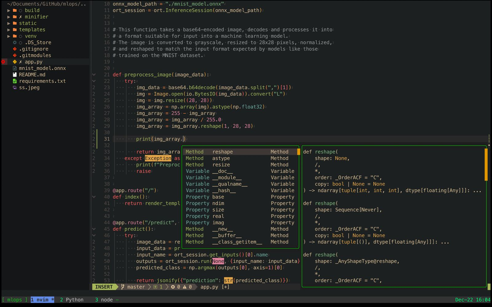

  <a href="https://adimail.github.io/">
    <picture>
      
    </picture>
    <h1 align="center">adimail config files</h1>
  </a>

So, I'm a tools guy. Always messing around with stuff to speed up my workflow.
This repository has my personal configuration files for various tools for an
efficient and customized development environment. Expect lots of scripts,
aliases, and hotkey goodness designed to keep things quick and efficient.

It includes:

- Neovim (`nvim/`)
- Shell (`zsh/.zshrc`)
- Terminal Multiplexer (`tmux/`)
- Version Control (`git/`): Git settings, global ignore, and commit template.
- Terminal Emulator (`ghostty/`)
- System Monitor (`htop/`): Custom htop settings.
- System Information (`neofetch/`): Personalized Neofetch display.
- C/C++ Formatting (`cland/`): Settings for `clang-format` and `clangd`.
- Custom Scripts (`scripts/`): A collection of utility scripts, including:
  - `lazyffmpeg`: A script for simplified FFmpeg operations (built by me).
  - `sessionizer`: A script for managing tmux sessions (built by ThePrimeagen).
  - [grepforllm](https://github.com/adimail/grepforllm): cli tool to generate LLM-ready context from codebase
  - Other utilities for project management and development workflows.
- Programming Setup (`programmingsetup/`): Templates and scripts for competitive programming (Codeforces) and LeetCode.

## SS

