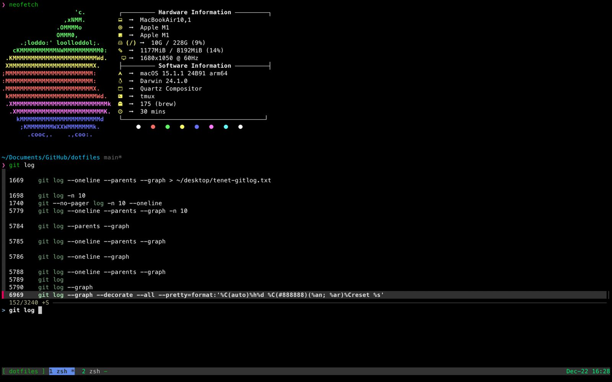

<p align="center">
  <a href="https://adimail.github.io/">
    <picture>
      
    </picture>
    <h1 align="center">adimail config files</h1>
  </a>
</p>

## One script setup

Windows

```bash
Set-ExecutionPolicy Unrestricted -Scope CurrentUser
iex (iwr 'https://raw.githubusercontent.com/adimail/dotfiles/refs/heads/main/windows.ps1')
```

## Keybindings

### LSP

| **Keybinding** | **Description**                                                             |
| -------------- | --------------------------------------------------------------------------- |
| `gD`           | Jump to the declaration of the symbol under the cursor.                     |
| `gd`           | Go to the definition of the symbol under the cursor.                        |
| `gi`           | Show all implementations of the symbol under the cursor.                    |
| `<leader>D`    | Go to the type definition of the symbol under the cursor.                   |
| `<leader>wa`   | Add a workspace folder to the LSP client.                                   |
| `<leader>wr`   | Remove a workspace folder from the LSP client.                              |
| `<leader>wl`   | List all workspace folders currently known to the LSP client.               |
| `<leader>e`    | Show diagnostic information in a floating window.                           |
| `[d`           | Jump to the previous diagnostic message.                                    |
| `]d`           | Jump to the next diagnostic message.                                        |
| `<leader>q`    | Set the list of diagnostics to the location list.                           |
| `<leader>ld`   | Same as `<leader>q`, set diagnostics to the location list.                  |
| `<leader>qd`   | Set diagnostics to the quickfix list.                                       |
| `<leader>so`   | Open Telescope for LSP document symbols search.                             |
| `<leader>sd`   | Open Telescope to search and view diagnostics.                              |
| `K`            | Show hover documentation for the symbol under the cursor.                   |
| `gf`           | Open LSP symbol finder for the current document.                            |
| `<leader>gf`   | Open LSP symbol finder with implementation details.                         |
| `gx`           | Trigger a code action for the symbol under the cursor.                      |
| `<leader>ca`   | Trigger a code action for the symbol under the cursor (with a description). |

### Telescope

| **Keybinding** | **Description**                                         |
| -------------- | ------------------------------------------------------- |
| `<leader>ff`   | Find Files                                              |
| `<leader>fg`   | Live grep file content                                  |
| `<leader>ob`   | Search opened buffers                                   |
| `<leader>O`    | Search opened buffers                                   |
| `<leader>fh`   | Search help manual page                                 |
| `<leader>td`   | Toggle Todo Telescope                                   |
| `<leader>jl`   | Toggle Telescope jumplist                               |
| `<leader>fw`   | Grep strings below the cursor                           |
| `<leader>so`   | Search document symbols with LSP                        |
| `<leader>sd`   | Search diagnostics with Telescope                       |
| `<leader>ht`   | Search harpoon marks                                    |
| `<leader>cf`   | Fuzzy search in the current buffer without line numbers |

## Plugins

This is the list of plugins avaliable in this config.

| Plugin Name              | Description                                                                       |
| ------------------------ | --------------------------------------------------------------------------------- |
| **barbecue.lua**         | Breadcrumb navigation bar for your Neovim.                                        |
| **flash.lua**            | Navigation with a flash-style highlighting mechanism.                             |
| **neotest.lua**          | Running and managing tests directly within Neovim.                                |
| **nvim-ufo.lua**         | Adds folding capabilities with better context awareness.                          |
| **which-key.lua**        | Displays available keybindings in a popup window.                                 |
| **close-buffers.lua**    | Allows better buffer management, like closing multiple buffers at once.           |
| **format.lua**           | A plugin for on-the-fly code formatting.                                          |
| **lsp**                  | Neovim LSP client.                                                                |
| **nvim-dap.lua**         | Integrates debugging tools using the Debug Adapter Protocol (DAP).                |
| **scrollbar.lua**        | Adds a customizable scrollbar to Neovim.                                          |
| **cmp.lua**              | Implements a completion framework for coding.                                     |
| **gitsigns.lua**         | Displays Git changes and diffs in the sign column.                                |
| **lspsaga.lua**          | Enhances the default LSP UI with rich features like code actions and diagnostics. |
| **nvim-hlslens.lua**     | Highlights search matches and displays additional information.                    |
| **telescope.lua**        | A fuzzy finder for files, buffers, and other resources.                           |
| **cursorword.lua**       | Highlights the word under the cursor.                                             |
| **gomove.lua**           | Adds easy-to-use keybindings for moving and duplicating text.                     |
| **lualine.lua**          | A customizable status line for Neovim.                                            |
| **luasnip.lua**          | A snippet engine for managing code templates (Stored in /lua/snippets/).          |
| **nvim-spectre.lua**     | A search-and-replace tool with a preview feature.                                 |
| **nvim-surround.lua**    | Simplifies surrounding text objects with pairs (e.g., parentheses, quotes).       |
| **treesitter.lua**       | Provides enhanced syntax highlighting and code understanding using Tree-sitter.   |
| **trouble.lua**          | Displays diagnostics and quickfix lists in a structured and user-friendly way.    |
| **dashboard.lua**        | Adds a configurable startup dashboard to Neovim.                                  |
| **harpoon.lua**          | A tool to quickly navigate between frequently used files.                         |
| **indent-blankline.lua** | Adds visual indicators for indentation levels.                                    |
| **mason.lua**            | Manages LSP servers, DAP servers, linters, and formatters.                        |
| **nvim-tree.lua**        | Adds a file explorer sidebar to Neovim.                                           |
| **todo-comments.lua**    | Highlights and organizes TODO comments in code.                                   |
| **diffview.lua**         | Provides a Git diff viewer for better version control.                            |

## SS




